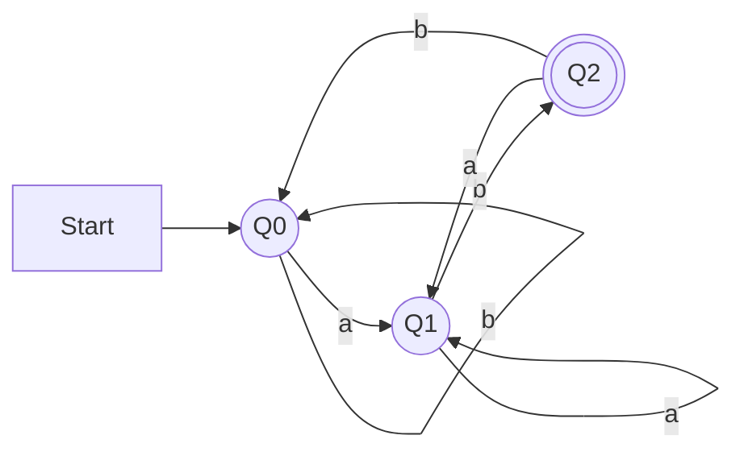

regex = [ab]*ab

```mermaid
flowchart LR
    S[Start]
    Q0((Q0))
    Q1((Q1))
    Q2(((Q2)))

    S --> Q0
    Q0 -- b --> Q0
    Q1 -- a --> Q1
    Q0 -- a --> Q1
    Q1 -- b --> Q2
    Q2 -- a --> Q1
    Q2 -- b --> Q0
```