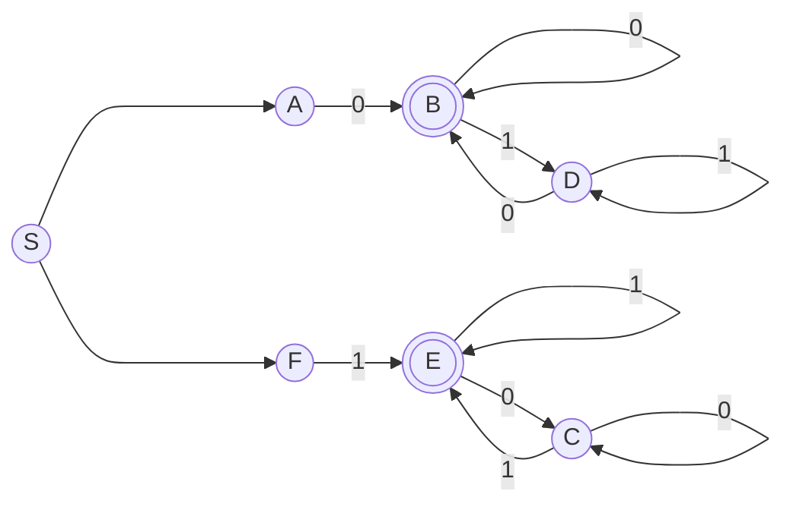

Write a regular expression for the language with Sigma = {0, 1}

{w | w starts and ends with the same character}


---

```
regex = (1((0|1)*1)?) | (0((0|1)*0)?) 
     ou (1[0-1]*1) | (0[0-1]*0) | 1 | 0 
```


