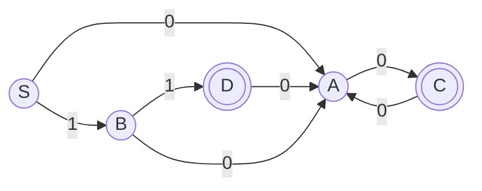

Sketch a nondeterministic finite automaton for the language

{w | w contains an even number of Os or extacly two 1s}

---

```mermaid
flowchart LR
    S((S))
    A((A))
    B((B))
    C(((C)))
    D(((D)))

    S -- 0 --> A
    S -- 1 --> B
    A -- 0 --> C
    C -- 0 --> A
    B -- 1 --> D
    D -- 0 --> A
    B -- 0 --> A
```